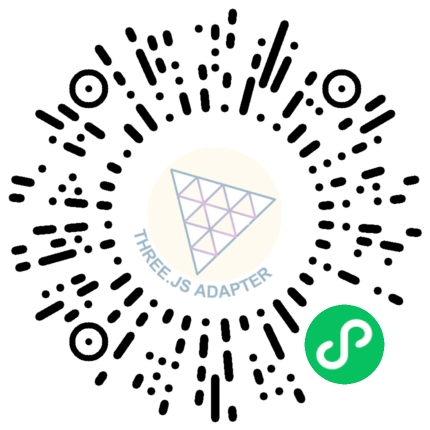

# Three.js Platform Adapter 小程序使用到的 three.js 相关示例源码

> 包含了 [three.js 官方](https://threejs.org/examples), [Tres.js](https://docs.tresjs.org/guide/) , [React Three Fiber](https://r3f.docs.pmnd.rs/getting-started/examples) 三部分示例

## 微信小程序

小程序详情可扫码查看

